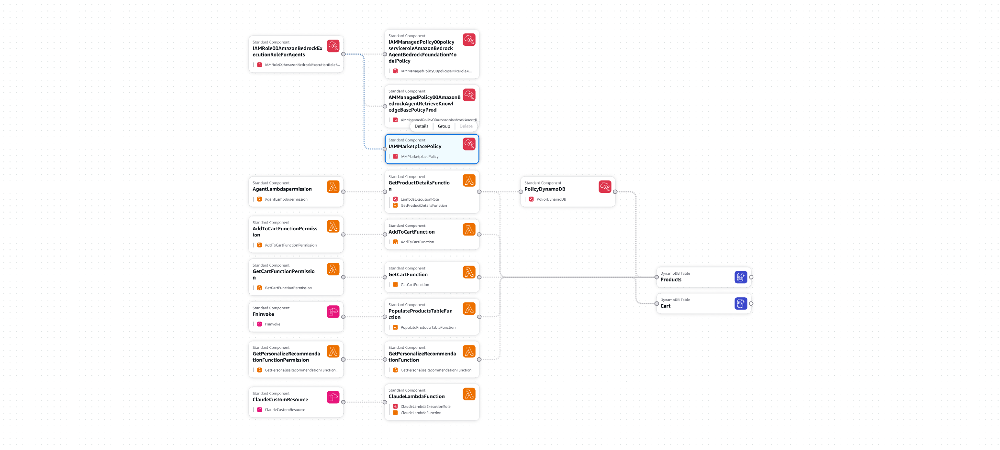
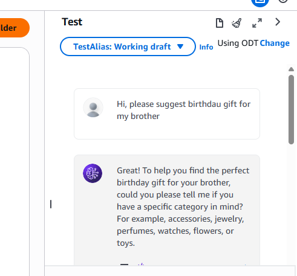
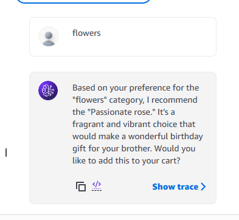
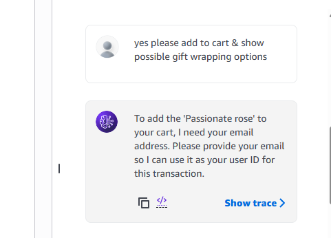
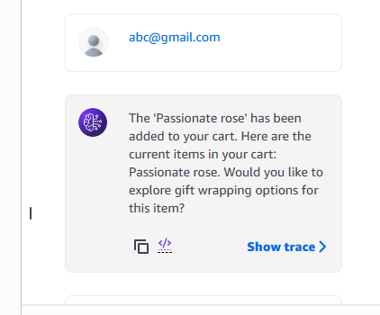
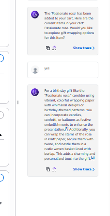

**AWS Bedrock Agent — Gift Recommender**

**Goal:**
  Build an ecommerce chatbot recommending the products for various occasion like birthday,personal events adding it in cart & recommend the personalized gift wrapping option to end user.

  **Technology Stack**: AWS Services like IAM Roles, Cloudformation, Bedrock, Lambda, Dynamo DB & S3.

**High Level Design**

-----
**Components:**

**User (Chat Interface)**

* The user interacts via a natural language conversation chat interface.
* The user describes the gift recipient & occasion
* The agent result are shown to the user (e.g., gift category, ask for adding in cart)
* There is a feedback loop: Agent analyzes gift descriptions and returns recommendations back to the user.

**Amazon Bedrock Agent — product-recommendation-agent**
Model: AWS Nova Pro | IAM Role: productallowsaj-ws4HRwi3IIAmazonBedrock

-----
**Action Groups (API Schema Definitions)**
There are 4 API actions defined:

**Action	Method	Required Params	Returns**

**get-product-recommendations	**
GET /products	Optional: person, category, gender, occasion, product_name	
JSON array with descriptions

**get-cart	**
GET /cart	Required: person (user_id)	
Array of product_name strings in user's cart

**add-item-to-cart	**
POST /cart	Required: person, product_name	
HTTP 200 on success 
HTTP 409 if already in cart

**get-amazon-personalize-recommendation	**
GET /personalize	Required: person, product_name	
Returns 1 recommended product with name, description, category, gender, occasion

------
**AWS Lambda Functions**
Four Lambda functions back the above APIs:

1. **GetProductDetailsFunction**
* Scans Products DynamoDB table
* Builds FilterExpression from: category, gender, occasion
* Params passed by the agent
* Returns matching products as JSON array with descriptions

2. **GetCartFunction**
* Queries Cart DynamoDB table
* Uses user_id as key
* Returns JSON array of product_name strings representing all items in the user's cart

3. **AddToCartFunction**
* Writes new item to Cart Table
* Records: (userID, productName)
* Checks for duplicate entry
* Returns HTTP 200 on success
* Returns HTTP 409 if product already in cart

4. **GetPersonalizeRecommendation Function**
* Schedules Amazon Personalize
* "Customers also bought" pattern
* Input: product_name string

**Output:** 1 recommended product with name, description, category, gender, occasion

Supporting: PopulateProductsTableFunction
* One-time setup function
* Generates/populates 100 sample gift products into the DynamoDB Products table

-----

**Data Stores & AWS Services**

**Amazon DynamoDB — Products Table**
Table: productTable[env]-ws-Products-XXXX
Partition Key: product_name (String)
Attributes: category | gender | occasion
Additional: product_description (String)

GSI on: gender (efficient gender filter)
GSI on: occasion (efficient occasion filter)
Pre-loaded: 100 sample gift products

**Amazon DynamoDB — Cart Table**

Table: productTable[env]-ws-Cart-XXXXX
Attribute: user_id (String) = user's email
Attribute: product_name (String)
Composite key: user_id + product_name

* Stores all items added to user's cart
* Persists across entire conversation

-----
**Knowledge Base for Amazon Bedrock — RAG Pipeline (Gift Wrapping Ideas)**

* Amazon S3 (Data Source)
* Bucket: amazonwsproductsbucket-#####Meta.txt.txt
* File: GiftWrapping.txt
* Content: gift wrapping ideas by: Occasion (Birthday, Anniversary, Wedding…) Gender (Male, Female, Others)

**Product category & type**

Step-by-step wrapping instructions
Multiple suggestions & color themes
Privacy: company data secure (not public)

**GiftWrappingKnowledgeBase**
Service: Knowledge Base for Amazon Bedrock

**Data Source: GiftWrappingKBsource**
* A connector: must manually click "Sync"
* Verify type from sync history entries
* Fully managed RAG workflow
* Auto document chunking & splitting
* Auto embedding generation (Titan Embeddings)
* Auto vector store provisioning

**Managed Vector Store**
* Auto-provisioned by Bedrock KB service
* Stores embeddings of GiftWrapping.txt
* Performs semantic similarity search
* When agent queries for wrapping ideas → matches query context to relevant passages in the source document

**KB Instructions for Agent**

* Added in Agent Builder → Knowledge Bases section
Instruction text: "This is a gift wrapping knowledge base for ideas on how to wrap gifts based on the gift details, the occasion, and its recipient"

-----
**CloudFormation Stack: AWS Bedrock Agent — Gift Recommender**

**Cloudformation Template Design Flow:**

We can configure the resources required for chatbot manually on AWS or can create the cloud formation template to configure all the resource required. The entire stack can be auto-provisioned via CloudFormation:

* DynamoDB Tables (Products + Cart)
* Lambda Functions (3 total: GetProducts, GetCart, AddToCart, GetPersonalizeRec, PopulateProducts)
* IAM Role
* S3 Bucket
* GiftWrappingKnowledgeBase

-----

**Agent Instructions via Chat Interface:**

* Suggest the various gift option categories for gender.
  
  

* Give the Category of Gift Option

  

* Ask for the user's to added gift in cart & show possible gift wrapping option

  

* Ask to input email for adding gift in cart

  
  
* After each cart addition: auto-fetch and display the updated cart contents to the user. At end of conversation: offer gift wrapping ideas from Knowledge Base.

  

These steps help to build an bedrock agent for product recommendations. [Ref](https://catalog.us-east-1.prod.workshops.aws/workshops/7ca892c2-91a4-47a7-a675-22c9e85b5e18/en-US/getting-started)
